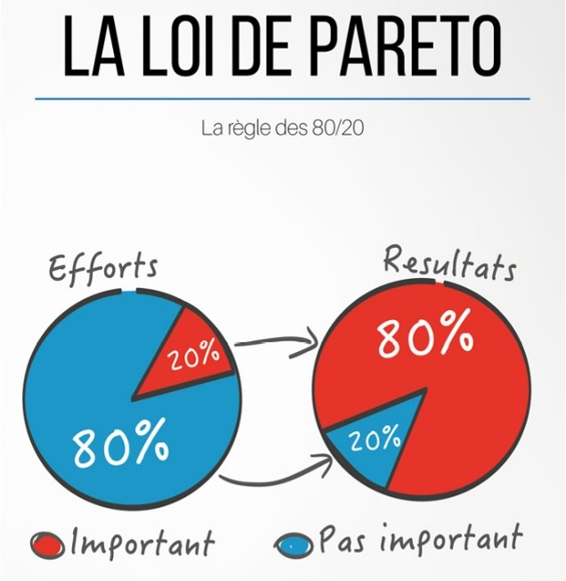
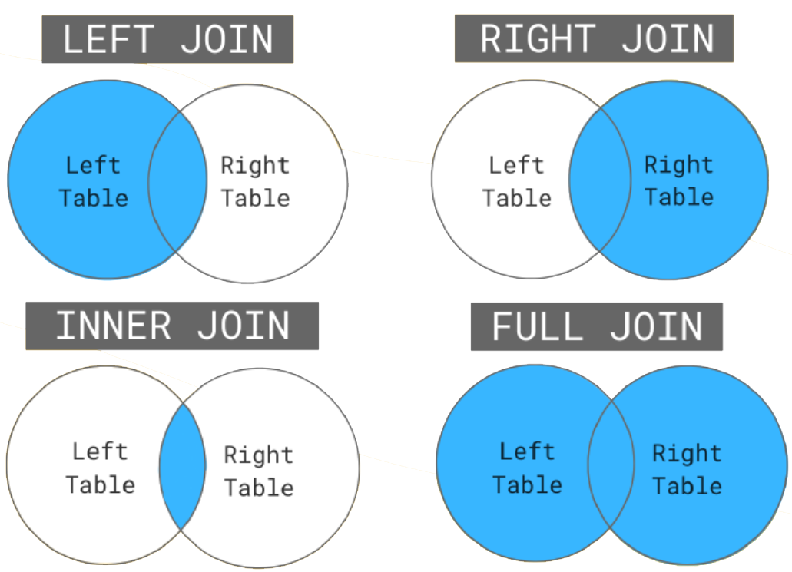
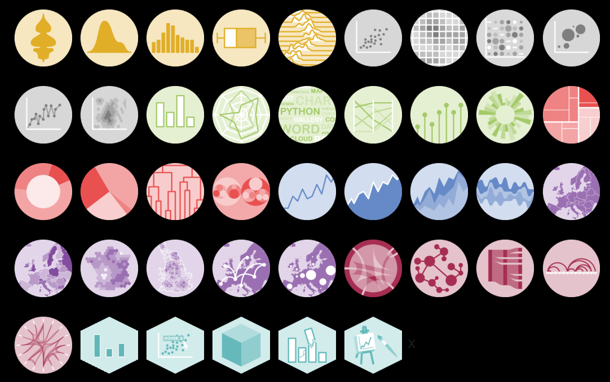

#  {background-image="images/background_title.png"}

[Formation R]{style="color:#ffffff; font-size: 2em"}

[Collection de packages tidyverse]{style="color:#ffffff; font-size: 1.5em"}

[Laure Velez ([laure.velez\@umontpellier.fr](mailto:laure.velez@umontpellier.fr))]{style="color:#ffffff; font-size: 0.8em"}

[Mathieu Depetris ([mathieu.depetris\@cnrs.fr](mailto:mathieu.depetris@cnrs.fr))]{style="color:#ffffff; font-size: 0.8em"}

[Monique Simier ([monique.simier\@ird.fr](mailto:monique.simier@ird.fr))]{style="color:#ffffff; font-size: 0.8em"}

[3 et 4 avril 2025]{style="color:#ffffff; font-size: 0.8em"}

[© RStudio]{style="color:#ffffff; font-size: 0.5em"}

{.absolute top="40" right="5" width="45%"}

## Plan de la formation {.smaller}

-   Préambule et introduction

    -   Prérequis et environnement de travail nécessaire à la formation
    -   Objectifs de la formation
    -   Présentation de [tidyverse](https://www.tidyverse.org/){.external target="_blank"}

-   Partie 1 : Importation de données sous R avec [readr](https://readr.tidyverse.org/){.external target="_blank"}

-   Partie 2 : Manipulation de données avec [dplyr](https://dplyr.tidyverse.org/){.external target="_blank"}

-   Partie 3 : Nettoyage des données avec [tidyr](https://tidyr.tidyverse.org/){.external target="_blank"}

-   Partie 4 : Manipuler du texte avec [stringr](https://stringr.tidyverse.org/){.external target="_blank"}

-   Partie 5 : Manipuler des dates avec [lubridate](https://lubridate.tidyverse.org/){.external target="_blank"}

-   Partie 6 : Visualisation graphique avec [ggplot2](https://ggplot2.tidyverse.org/){.external target="_blank"}

Formation fortement inspirée du site de [Joseph Larmarange](https://larmarange.github.io/analyse-R/){.external target="_blank"}

# Préambule et introduction

-   Prérequis et environnement de travail nécessaire à la formation
-   Objectifs de la formation
-   Présentation de [tidyverse](https://www.tidyverse.org/){.external target="_blank"}

## Prérequis et environnement de travail nécessaire à la formation

-   Avoir des notions de base dans l'utilisation de [R](https://www.r-project.org/){.external target="_blank"}
-   Avoir une instance valide de R sur son poste (durant la formation utilisation de la version [4.4.3](https://pbil.univ-lyon1.fr/CRAN/){.external target="_blank"} sous Windows)
-   Pour information, nous allons utiliser les packages-version et dépendances R suivants :
    -   [readr](https://readr.tidyverse.org/){.external target="_blank"} (utilisation de la version 2.1.5),
    -   [dplyr](https://dplyr.tidyverse.org/){.external target="_blank"} (utilisation de la version 1.1.4),
    -   [tidyr](https://tidyr.tidyverse.org/){.external target="_blank"} (utilisation de la version 1.3.1),
    -   [stringr](https://stringr.tidyverse.org/){.external target="_blank"} (utilisation de la version 1.5.1),
    -   [lubridate](https://lubridate.tidyverse.org/){.external target="_blank"} (utilisation de la version 1.9.4),
    -   [ggplot2](https://ggplot2.tidyverse.org/){.external target="_blank"} (utilisation de la version 3.5.1).

## Bonus non obligatoire

-   Utilisation de l'environnement de développement [Rstudio](https://posit.co/download/rstudio-desktop/){.external target="_blank"} (utilisation de la version 2024.12.1+563 sous Windows)
-   Pour les utilisateurs de Windows installation de [Rtools](https://cran.r-project.org/bin/windows/Rtools/){.external target="_blank"} (utilisation de la version 4.4)
-   Installation de [Visual Studio Code](https://code.visualstudio.com/Download){.external target="_blank"} (éditeur de code source autonome).

## Objectifs de la formation

::::: columns
::: {.column width="70%"}
-   Vous présenter un panel de ce que l'on peut faire avec ces méthodes et surtout vous donner les clés pour aller plus loin
-   Un expert n'est pas forcément quelqu'un qui connaît toutes les fonctions par cœur, mais qui sait écouter, comprendre et aller chercher les informations dont il a besoin
    -   Pensez à jeter un coup d'œil aux [cheatsheets](https://github.com/rstudio/cheatsheets){.external target="_blank"}
:::

::: {.column width="30%"}

:::
:::::

## Présentation de Tidyverse {.smaller}

::::: columns
::: {.column width="65%"}
-   Tidyverse c'est quoi ?
    -   tidy + universe ou l'univers du «bien rangé» ou du rangement
    -   Collection d'extensions conçues pour travailler ensemble et basées sur une philosophie commune
    -   Le cœur du package inclut 9 packages
        -   [ggplot2](https://ggplot2.tidyverse.org/){.external target="_blank"} : création de graphiques
        -   [dplyr](https://dplyr.tidyverse.org/){.external target="_blank"} : manipulation de données au sens large
        -   [tidyr](https://tidyr.tidyverse.org/){.external target="_blank"} : manipulation de données plus orientées variables
        -   [readr](https://readr.tidyverse.org/){.external target="_blank"} : import de données
        -   [purrr](https://purrr.tidyverse.org/){.external target="_blank"} : fonction de vectorisation (remplacement des boucles classiques)
        -   [tibble](https://tibble.tidyverse.org/){.external target="_blank"} : «évolution» du data.frame
        -   [stringr](https://stringr.tidyverse.org/){.external target="_blank"} : manipulation de caractère
        -   [forcats](https://forcats.tidyverse.org/){.external target="_blank"} : série d'outils pour aider dans la manipulation des facteurs
        -   [lubridate](https://lubridate.tidyverse.org/){.external target="_blank"} : fonctions permettant de travailler avec des dates et des heures
:::

::: {.column width="35%"}
{width="55%"} {width="80%"}
:::
:::::

## Présentation de Tidyverse

-   Lancement de la librairie

``` r
install.packages("tidyverse")
library(tidyverse)
```

-   Cependant je vous déconseille de faire comme ça
    -   En lançant cette commande, on charge dans R tous les packages associés à tidyverse (les 9 packages cités précédemment, mais aussi les dépendances associées)
    -   Avez-vous vraiment besoin de tout cela ?
    -   Potentiel impact sur vos futurs développements (surtout si vous commencez à développer des packages)
    -   L'idée est d'appliquer dès maintenant les bonnes pratiques et surtout de comprendre ce que cela implique de ne pas les suivre (ce qui est aussi votre droit !)

## Avant d'aller plus loin

-   L'utilisation de ces packages permet de faire beaucoup de choses, mais ne rend pas tout le reste obsolète
-   Il y a plusieurs stratégies pour réaliser une action, il faut juste trouver le bon compromis (connaissances, temps de calcul, contexte global de votre projet...)
-   Attention aux règles et conventions de nommages
    -   Règles pour nommer une variable (obligatoire) : ne pas commencer par un chiffre, pas d'espace, que des caractères alpha-numériques (A-z, 0-9) et le tiret du bas (\_), ne pas utiliser de mots réservés (comme par exemple TRUE)
    -   Conventions pour nommer une variable (recommandé) : uniquement des lettres minuscules, séparer les mots des \_ et les noms choisis doivent pouvoir donner l'information du contenu associé
    -   Une formation "bonnes pratiques en programmation" est à l'étude au sein du DEN

# Partie 1 : Importation de données sous R avec [readr](https://readr.tidyverse.org/){.external target="_blank"}.

::: {style="float: right;"}
[Lien cheatsheet](https://github.com/rstudio/cheatsheets/blob/main/data-import.pdf){.external target="_blank"}
:::


## Le package [readr](https://readr.tidyverse.org/){.external target="_blank"}

-   Des fonctions de base de R sont dédiées à l'import de fichiers textes de type csv (`read.csv`, `read.csv2`) ou tabulés (`read.table`) ou avec des séparateurs quelconques (`read.delim`)
-   La librairie [readr](https://readr.tidyverse.org/){.external target="_blank"} propose des fonctions similaires sur le principe mais qui diffèrent des fonctions de base sur certains aspects
-   Ces fonctions sont compatibles avec l'esprit **Tidyverse** car elles permettent de générer des [tibbles](https://tibble.tidyverse.org/){.external target="_blank"}

## Un [tibble](https://tibble.tidyverse.org/){.external target="_blank"} ... Cékoiça ???

-   Le *tibble* est un *data frame* amélioré
-   Ce format est géré par le package [tibble](https://tibble.tidyverse.org/index.html){.external target="_blank"} qui fait partie du coeur de tidyverse
-   Les *tibbles* contiennent un attribut *spec* qui précise les spécifications des colonnes (nom et type)
-   Ils s'affichent plus intelligemment que les *data frames* : par défaut affichages uniquement des premières lignes, ainsi que quelques informations supplémentaires utiles
-   Ils autorisent des noms de colonnes qui sont invalides pour les *data frames* (espaces, caractères spéciaux, nombres...)
-   Ils affichent un avertissement si on essaie d'accéder à une colonne qui n'existe pas
-   Ils n'ont pas de noms de lignes (*rownames*)

## On peut passer du *tibble* au *dataframe* et vice-versa

-   La plupart des fonctions du tidyverse acceptent des *data frames* en entrée, mais retournent un objet de classe *tibble*
-   On peut convertir un *data frame* en *tibble* avec la fonction [as_tibble](https://tibble.tidyverse.org/reference/as_tibble.html){.external target="_blank"}, ou l'inverse avec la fonction [as.data.frame](https://rdrr.io/r/base/as.data.frame.html){.external target="_blank"}

## Les principales fonctions de la librairie **readr**

Les fonctions de readr les plus utilisées sont :

``` r
# Fonction générale, pour importer un fichier avec un délimiteur quelconque
read_delim(file, delim, ...)
# Import fichiers csv au format anglais (point décimal et séparateur virgule)
read_csv(file, ...)
# Import fichiers csv au format français (virgule décimale et séparateur point-virgule)
read_csv2(file, ...)
# Import fichiers au format tsv ou les valeurs sont séparées par des tabulations
read_tsv(file, ...)
# Pour lire un fichier en "chunks", c'est à dire en tranches dont on définit la taille en nombre de lignes.
# Cette fonction permet de lire de très gros fichiers  
# et aussi d'appliquer une fonction (CallBack) sur les données à chaque tranche. 
# xxx est à remplacer par csv, csv2, delim
read_xxx_chunked(file, callback, ...)
```

## [read_delim()](https://readr.tidyverse.org/reference/read_delim.html){.external target="_blank"}, la fonction la plus générique {.smaller}

-   Import de fichier avec la possibilité d'utiliser des paramètres
-   Fonction générale, son fonctionnement permet une approche simple des autres fonctions plus spécifiques d'import
-   Parmi toutes les possibilités, on trouve comme paramètres:
    -   file : chemin d'un fichier, d'une connexion ou même des données écrites à la main,
    -   delim : délimiteur utilisé pour séparer les champs
    -   col_names : configuration d'une en-tête (ou pas)
    -   col_types : spécification des types de colonnes
    -   col_select : selection des colonnes à conserver (même langage que avec [dplyr](https://dplyr.tidyverse.org/){.external target="_blank"})
    -   na : interprétation des valeurs manquantes
    -   skip : échappement de lignes lors de l'import
    -   name_repair : réparation "intelligente" des noms de colonnes
-   Beaucoup d'autres sont disponibles en lien avec vos besoins !

## On a aussi des fonctions de raccourci

-   En lien avec la nature de vos imports
-   La plupart des paramètres de la fonction `read_delim` sont utilisables
    -   `read_csv` et `read_csv2` pour les fichiers csv,
    -   `read_tsv` pour les fichiers tsv
-   On a aussi les fonctions `_chunked` pour commencer à s'amuser
    -   `read_delim_chunked`, `read_csv_chunked`, `read_csv2_chunked` et `read_tsv_chunked`

## La fonction inverse : [write\_...](https://readr.tidyverse.org/reference/write_delim.html){.external target="_blank"} pour exporter un fichier

``` r
# Pour exporter en csv
write_csv(x, file, ...)
write_csv2(x, file, ...)
# Pour exporter en choisissant le délimiteur 
write_delim(x, file, delim, ...)
# Pour exporter en tsv
write_tsv(x, file, ...)
```

## Encore une fois des paramètres

-   Notamment :
    -   x : nom de l'objet dans l'environnement R
    -   file : chemin du fichier que l'on veut créer (ne pas oublier l'extension)
    -   delim : délimiteur utilisé pour séparer les champs
    -   na : interprétation des valeurs manquantes
    -   append : si FALSE écrasera un fichier existant portant le même nom que l'export, TRUE rajoutera nos données exportées au fichier existant (si c'est possible)
    -   col_names : inclusion du nom des colonnes dans l'export

## Autres fonctions utiles

-   Extraction complète des spécifications d'un tibble avec `spec`
-   `cols_condense` permet d'afficher une version simplifiée des spécifications en affichant le type par défaut le plus fréquent et liste les colonnes avec un type différent. Attention, l'entrée est un objet de type `spec`.

## Import de feuilles de calcul (type excel)

-   Utilisation du package [readxl](https://readxl.tidyverse.org/){.external target="_blank"}
    -   Developpé par l'équipe de tidyverse (extension des packages du cœur)

``` r
# Fonction générique
read_excel(path, ...)
# Fonction pour importer spécifiquement un xls (excel avant 2007) ou xlsx (extension actuelle par défaut)
read_xls(path, ...)
read_xlsx(path, ...)
```

-   Globalement des arguments similaires à précédement (`col_names`, `skip`, `col_types`, ...)
-   Introduction de l'argument `sheet` et `range`
-   Nécessité de bien définir les types de colonnes
-   Pour les exports on utilisera [openxlsx](https://cran.r-project.org/web/packages/openxlsx/index.html){.external target="_blank"} ou [writexl](https://cran.r-project.org/web/packages/writexl/index.html){.external target="_blank"}

## Import de feuilles de calcul (type google)

-   Utilisation du package [googlesheets4](https://googlesheets4.tidyverse.org/){.external target="_blank"}
    -   Développé encore une fois par l'équipe de tidyverse (extension des packages du cœur)
-   3 familles de fonctions (liste non exhaustive) :
    -   `read_sheet` pour lire une feuille
    -   `gs4_get` ou encore `gs4_find` pour lire les métadonnées associées aux feuilles
    -   `write_sheet` ou `sheet_append` pour exporter des feuilles
-   On retrouve encore le même type d'arguments que précédemment

## Petit point sur les types de colonne

-   Très bien expliqué dans la documentation de la fonction [read_delim](https://readr.tidyverse.org/reference/read_delim.html){.external target="_blank"} au niveau de l'argument `col_types`
-   Renvoi à la fonction [cols](https://readr.tidyverse.org/reference/cols.html){.external target="_blank"} qui permet de définir un type de colonne
    -   Parait anodin, mais très important, notamment pour les processus de "verification"
    -   Par exemple un chiffre sans virgule (type entier) ce n'est pas pareil qu'un chiffre à virgule (type double)
-   En lien avec les fonctions d'import, on peut utiliser des raccourcis pour définir nos types de colonnes
    -   Par exemple `c` pour un caractère à la place de `col_character`
    -   La liste complète est disponible dans la documentation de [read_delim](https://readr.tidyverse.org/reference/read_delim.html){.external target="_blank"}
-   Ici il faut garder en tête l'objectif de lever les ambigüités

# Avantages de [readr](https://readr.tidyverse.org/){.external target="_blank"} *vs.* les fonctions de base

## [readr](https://readr.tidyverse.org/){.external target="_blank"} est en général plus rapide

-   Du cas par cas mais globalement mieux adapté aux "gros" fichiers (en lien avec des fonctions orientées objet)
-   Par exemple (tendance sans tenir compte d'autres facteurs comme l'ordinateur) pour un fichier csv de 156Mo
    -   30.84s avec read_csv contre 30.00s avec read.csv
-   Pour un fichier csv de 468Mo
    -   38.63s avec read_csv contre 47.56s avec read.csv

## Le vrai avantage réside dans la polyvalence

-   Beaucoup de paramétrisation possible
    -   Toutes les spécifications citées précédemment
    -   Un gros plus sur la sélection des colonnes via l'argument `col_select` (sélection et renommage)
    -   Filtrage direct lors de l'import avec les `_chunked` ou encore l'argument `skip`
-   Possibilité de lire les fichiers depuis une archive (type zip) avec readr
-   Possibilité de lire plusieurs fichiers en une fois, même plusieurs répertoires
-   Vraie dynamique d'évolution dans le futur !

## Exercice 1.1 {auto-animate="true"}

-   Lire le fichier survey_metadata et le stocker dans un objet R `survey_metadata`,
-   Lire le fichier reef_fish_biomass et le stocker dans un objet R `reef_fish_biomass`
-   Lire le fichier reef_fish_abundance et le stocker dans un objet R `reef_fish_abundance`

Attention ! On ne triche pas, aucune manipulation des fichiers pré-importation

``` r
```

## Exercice 1.1 corrigé {auto-animate="true"}

-   Lire le fichier survey_metadata et le stocker dans un objet R `survey_metadata`,
-   Lire le fichier reef_fish_biomass et le stocker dans un objet R `reef_fish_biomass`
-   Lire le fichier reef_fish_abundance et le stocker dans un objet R `reef_fish_abundance`

Attention ! On ne triche pas, aucune manipulation des fichiers pré-importation

``` r
# solution
survey_metadata <- read_tsv(file = "data/survey_metadata.tsv")
reef_fish_biomass <- read_delim(file = "data/reef_fish_biomass.dude",
                                delim = "|")
Sys.setenv("VROOM_CONNECTION_SIZE" = 500000)
reef_fish_abundance <- read_csv(file = "data/reef_fish_abundance.zip",
                                col_types = list(.default = col_integer()))
```

## Exercice 1.2 {auto-animate="true"}

Lire le fichier survey_metadata et le stocker dans un objet R `survey_metadata` en sélectionnant le pays Indonésie, une profondeur inférieure à 20m et une visibilité supérieure à 10m.

``` r
```

## Exercice 1.2 corrigé {auto-animate="true"}

Lire le fichier survey_metadata et le stocker dans un objet R `survey_metadata` en sélectionnant le pays Indonésie, une profondeur inférieure à 20m et une visibilité supérieure à 10m.

``` r
# solution
function_1_2 <- function(x, pos) subset(x, country == "Indonesia" & depth < 20 & visibility > 10)
survey_metadata_selection_1_2 <- read_tsv_chunked(file = "data/survey_metadata.tsv",
                                                  callback = DataFrameCallback$new(function_1_2),
                                                  chunk_size = 1000)
```

# Partie 2 : Manipulation de données avec [dplyr](https://dplyr.tidyverse.org/){.external target="_blank"}

::: {style="float: right;"}
[Lien cheatsheet](https://github.com/rstudio/cheatsheets/blob/main/data-transformation.pdf){.external target="_blank"}
:::


## [dplyr](https://dplyr.tidyverse.org/){.external target="_blank"}

### Pourquoi utiliser dplyr et sa syntaxe ?

-   Syntaxe claire et cohérente
    -   "lien" avec le SQL
    -   deux "familles" de fonctions : résumé et vectorisation <br/> <br/> <br/> {.absolute top="320" left="15"} {.absolute top="320" right="15"}
-   Utilisation de verbes
-   Généralement plus rapides que leur équivalent sous R de base
-   Permet d'enchainer les opérations avec des "pipes" {.absolute top="450" right="20" width="15%"}

## Manipulation des lignes

### Manipulation de type extraction

Type de fonctions qui retournent un sous-ensemble de lignes

-   Extraction d'une ou plusieurs lignes : fonctions de la famille slice & co

``` r
# sélection d'une ou plusieurs lignes par position absolue (l'argument x est l'indice de la ou des lignes)
slice(.data, x, ...)
# sélection au hasard d'un nombre de lignes ou d'une proportion du jeu de données
slice_sample(.data, n/prop, ...)
# sélection des n dernières lignes
slice_tail(.data, n/prop, ...)
# sélection des n premières lignes
slice_head(.data, n/prop, ...)
# sélection des lignes avec les valeurs les plus petites ou grandes
slice_min(.data, n/prop, ...)
slice_max(.data, n/prop, ...)
# sélection des valeurs distinctes
distinct(.data, ...)
# sélection en fonction d'opérateurs logiques et/ou booléens
filter(.data, ...)
```

## Petit focus sur les opérateurs booléens et logiques {.smaller}

Renvoient une valeur TRUE ou FALSE

-   les communs :


-   certains plus particuliers :

{width="25%"}

-   Attention aux priorités dans les interprétations
    -   & est plus fort que \|, il sera exécuté en premier
    -   une solution est d'utiliser des () pour séparer vos opérateurs

## Exercice 2.1 {auto-animate="true"}

-   À l'aide d'une fonction dplyr, vérifier s'il y a des données dupliquées dans le jeu de données "reef_fish_biomass"
-   En plus et en une seule fois, sélectionner les données dont la variable "biomass" est différente de 0, où la famille est différente de "Mullidae" et "Apogonidae" et pour finir où la classe de taille associée est \<= 10. Stocker le résultat dans un objet nommé `biomass_exercice2_1_distinct_filter`.

``` r
```

## Exercice 2.1 corrigé {auto-animate="true"}

-   À l'aide d'une fonction dplyr, vérifier s'il y a des données dupliquées dans le jeu de données "reef_fish_biomass"
-   En plus et en une seule fois, sélectionner les données dont la variable "biomass" est différente de 0, où la famille est différente de "Mullidae" et "Apogonidae" et pour finir où la classe de taille associée est \<= 10. Stocker le résultat dans un objet nommé `biomass_exercice2_1_distinct_filter`.

``` r
biomass_exercice2_1_distinct <- distinct(.data = reef_fish_biomass)
biomass_exercice2_1_distinct_filter <- filter(.data = biomass_exercice2_1_distinct,
                                              biomass != 0
                                              & ! family %in% c("Mullidae",
                                                                "Apogonidae")
                                              & size_class <= 10)
```

## Amélioration de la lisibilité du code

Ici on a effectué 2 opérations, mais on peut imaginer en faire beaucoup plus dans la réalité.

Grâce à la syntaxe de dplyr, on peut répondre à ce besoin de deux manières différentes.

La première est d'effectuer toutes les opérations en une fois en les emboîtant :

``` r
biomass_exercice2_1_distinct_filter <- filter(.data = distinct(.data = reef_fish_biomass),
                                              biomass != 0
                                              & ! family %in% c("Mullidae",
                                                                "Apogonidae")
                                              & size_class <= 10)
```

Cependant cela a plusieurs inconvénients. La structure est peu lisible, les opérations apparaissent dans l'ordre inverse de leur réalisation et il est difficile de voir quel paramètre se rapporte à quelle fonction.

## Aller encore plus loin

### Utilisation d'un nouvel opérateur baptisé [pipe](https://magrittr.tidyverse.org/){target="_blank"}

-   Il se note %\>%

-   Son fonctionnement est le suivant : si j'exécute expr %\>% f, le résultat de l'expression expr, à gauche du pipe, sera passé comme premier argument à la fonction f, à droite du pipe, ce qui revient à exécuter f(expr)

-   L'intérêt est que l'on peut enchainer plusieurs pipes et surtout on simplifie la syntaxe

-   Avec notre exemple précédent cela donne :

``` r
biomass_exercice2_1_distinct_filter <- distinct(.data = reef_fish_biomass) %>%
  filter(biomass != 0
         & ! family %in% c("Mullidae",
                           "Apogonidae")
         & size_class <= 10)
```

## Encore quelques fonctions de manipulation de lignes

### Manipulation de type "tri"

-   Ordonner les lignes d'une ou plusieurs colonnes

``` r
# par défaut ordre croissant, utiliser l'argument desc pour ordre décroissant
arrange(.data, ...)
```

<br/>

### Manipulation de type "ajout"

-   Ajouter une ligne dans un jeu de données

``` r
# utilisation du package tibble (dépendance)
# interet des arguments .before and .after
add_row(.data, ...)
```

## Manipulation des variables

### Extraction d'une ou plusieurs colonnes

Type de fonctions qui retournent un sous-ensemble de colonnes sous la forme d'un vecteur ou d'une table

``` r
# extraction des valeurs d'une colonne sous la forme d'un vecteur
# on peut utiliser des noms ou les ids
pull(.data, var, ...)
# extraction d'une colonne sous la forme d'une table
# bien regarder les arguments de la fonction car on peut faire beaucoup
select(.data, ...)
# Changer l'ordre ou la place d'une ou plusieurs colonnes
# ne pas oublier les arguments .after et .before
relocate(.data, ...)
```

## Fonctions de vectorisation

### Une des deux grandes familles de fonctions avec dplyr

-   On a commencé à l'aborder de manière instinctive avec relocate()

-   Globalement, ce sont des fonctions qui ont un vecteur en entrée et retournent un vecteur de la même taille en sortie <br/> <br/> <br/> {.absolute top="300" left="250" width="50%"}

``` r
# créer une nouvelle variable
mutate(.data, ...)
```

-   Petit bonus pour renommer les variables

``` r
rename(.data, ...)
```

## Exercice 2.2 {.smaller auto-animate="true"}

-   À partir du jeu de données de sortie de l'exercice 1 (`biomass_exercice2_1_distinct_filter`)
-   Créer une variable "survey_id_full" qui est la concaténation des variables survey_id, species_name et size_class
-   Placer cette nouvelle colonne avant la colonne survey_id
-   Supprimer la quatrième colonne du jeu de données (utiliser son indice) ainsi que la colonne reporting_name
-   Renommer la variable size_class en size_class_cm
-   Créer une nouvelle variable size_class_mm qui convertit la variable size_class_cm en mm
-   Supprimer la variable size_class_cm
-   Trier par ordre décroissant les données en fonction de la variable size_class_mm
-   Utiliser des pipes à la fin pour avoir une syntaxe "propre", stocker le resultat dans un objet nommé `biomass_exercice2_2` et souffler un bon coup :)

``` r
```

## Exercice 2.2 corrigé {.smaller auto-animate="true"}

-   À partir du jeu de données de sortie de l'exercice 1 (`biomass_exercice2_1_distinct_filter`)
-   Créer une variable "survey_id_full" qui est la concaténation des variables survey_id, species_name et size_class
-   Placer cette nouvelle colonne avant la colonne survey_id
-   Supprimer la quatrième colonne du jeu de données (utiliser son indice) ainsi que la colonne reporting_name
-   Renommer la variable size_class en size_class_cm
-   Créer une nouvelle variable size_class_mm qui convertit la variable size_class_cm en mm
-   Supprimer la variable size_class_cm
-   Trier par ordre décroissant les données en fonction de la variable size_class_mm
-   Utiliser des pipes à la fin pour avoir une syntaxe "propre", stocker le resultat dans un objet nommé `biomass_exercice2_2` et souffler un bon coup :)

``` r
# solution
biomass_exercice2_2 <- mutate(.data = biomass_exercice2_1_distinct_filter,
                              survey_id_full = paste(survey_id,
                                                     species_name,
                                                     size_class,
                                                     sep = "_")) %>%
  relocate(survey_id_full,
           .before = survey_id) %>%
  select(-4,
         -reporting_name) %>%
  rename(size_class_cm = size_class) %>%
  mutate(size_class_mm = size_class_cm * 10) %>%
  select(-size_class_cm) %>%
  arrange(desc(size_class_mm))
```

## Fonctions de resumé {.smaller}

### La deuxième grande famille

-   Fonctions qui vont créer une nouvelle table avec des resumés statistiques. De manière globale, les fonctions associées vont utiliser en entrée des vecteurs et en sortie une ou plusieurs valeurs ( en nombre inférieur au nombre de vecteurs d'entrée) <br/> <br/> <br/> {.absolute top="200" left="250" width="50%"}

-   Fonction clé

``` r
summarise(.data, ...)
# Beaucoup, beaucoup d'options et de possibilités
# Compter le nombre de valeurs/lignes
n()
# Compter le nombre de valeurs/lignes distinctes
n_distinct()
# Faire une moyenne
mean()
# Faire une somme, option na.rm disponible
sum()
# Utiliser des notions de position
first()
last()
# Ou de rang
quantile()
min()
max()
```

## Introduction à la notion de groupe

-   Pour le moment on a fait des opérations sur l'ensemble du jeu de données, pas très pertinent non ?

-   Fonction de création de groupe

``` r
# on peut définir nos groupes en fonction des modalités des variables
# on peut aussi utiliser des arguments des fonctions quand c'est proposé, exemple avec .by de summarise()
group_by(.data, ...)
# ou alors en isolant chaque ligne (utile surtout pour les fonctions qui ne vectorise pas)
rowwise()
```

-   Attention à ce que vous faites ! Par défaut, les groupes sont gardés en mémoire dans votre jeu de données de sortie (lisez les messages de R). Pour y remédier :

``` r
# via un summarise (argument experimental, attention à la pérennité)
.groups
# de manière plus générale
ungroups()
```

-   Cette notion de groupe peut être utilisée avec d'autres fonctions (comme un mutate)

## Exercice 2.3 {.smaller auto-animate="true"}

-   À partir du jeu de données de sortie de l'exercice 2.2 (`biomass_exercice2_2`)
-   Effectuer la somme de la biomasse (variable biomass) en fonction de la variable survey_id_full créée précédemment
-   Pour survey_id_full répétés, ne garder que la première ligne de chaque répétition. Attention à bien conserver toutes les colonnes associées (une fois la fonction "trouvée" regarder du côté des arguments en option)
-   Créer un nouveau jeu de données qui exprime le nombre d'échantillons disponibles par famille et vérifier la cohérence du nombre total obtenu avec le jeu de données de départ
-   Stocker tout ça dans un objet nommé `biomass_exercice2_3`

``` r
```

## Exercice 2.3 corrigé {.smaller auto-animate="true"}

-   À partir du jeu de données de sortie de l'exercice 2.2 (`biomass_exercice2_2`)
-   Effectuer la somme de la biomasse (variable biomass) en fonction de la variable survey_id_full créée précédemment
-   Pour survey_id_full répétés, ne garder que la première ligne de chaque répétition. Attention à bien conserver toutes les colonnes associées (une fois la fonction "trouvée" regarder du côté des arguments en option)
-   Créer un nouveau jeu de données qui exprime le nombre d'échantillons disponibles par famille et vérifier la cohérence du nombre total obtenu avec le jeu de données de départ
-   Stocker tout ça dans un objet nommé `biomass_exercice2_3`

``` r
# solution
biomass_exercice2_3 <- biomass_exercice2_2 %>%
  dplyr::group_by(survey_id_full) %>%
  mutate(sum_biomass = sum(x = biomass)) %>%
  ungroup() %>%
  distinct(survey_id_full,
           .keep_all = TRUE)
biomass_exercice2_3_sample_verification <- dplyr::group_by(.data = biomass_exercice2_2,
                                                           family) %>%
  summarise(nb_sample_family = n()) %>%
  mutate(total = sum(nb_sample_family))
```

## Fonction bonus très utile {.smaller}

### case_when : généralisation vectorisée de if(s)

-   Vectorisation de multiples if_else sous R et CASE WHEN en SQL
-   Améliore grandement la lisibilité de vos fonctions
-   Syntaxe de base :

``` r
case_when(
  operateur(s) booléen(s) ou logique(s) ~ output1,
  operateur(s) booléen(s) ou logique(s) ~ output2,
  ....
  operateur(s) booléen(s) ou logique(s) ~ output_n,
  TRUE ~ output si rien ne marche au dessus
)
```

-   Pensez bien à toujours mettre un TRUE (=valeur par défaut)
-   Attention à ne pas mélanger les types, il existe différents NA :
    -   NA_integer\_
    -   NA_real\_
    -   NA_complex\_
    -   NA_character\_

## Combinaison de jeux de données 1

### Jointures "simples"

-   Il doit y avoir une cohérence entre le nombre de colonnes ou de lignes
-   Attention, aucune vérification de cohérence des jointures

``` r
# "Coller" deux jeux de données
bind_cols()
bind_rows()
```

## Combinaison de jeux de données 2 {.smaller}

### Jointures de type relationnel

::::: columns
::: {.column width="70%"}
-   Très proche du SQL
-   Très puissantes et permettent de se poser les bonnes questions !
-   Attention à bien spécifier l'argument by (ne pas laisser place à l'interprétation !)
    -   On peut spécifier une seule ou plusieurs colonnes si les noms sont identiques entre les deux jeux de données
    -   Sinon on spécifie le nom du jeu de données à "gauche" et celui qui est à "droite"
:::

::: {.column width="30%"}

:::
:::::

``` r
# jointure à gauche
left_join(x, y, by, ...)
# jointure à droite
right_join(x, y, by, ...)
# jointure commune
inner_join(x, y, by, ...)
# jointure complete
full_join(x, y, by, ...)
```

## Exercice 2.4 {.smaller auto-animate="true"}

-   À partir du jeu de données de sortie de l'exercice 2.3 (`biomass_exercice2_3`)
-   Faire la "meilleure" jointure avec le jeu de données `survey_metadata` et expliquer votre choix
-   Pour vous aider :
    -   Y-a-t-il un problème avec le jeu de données `survey_metadata` ?
    -   Réfléchissez en termes du nombre de lignes obtenues pour chaque fonction de jointure
-   Stocker le résultat dans un objet nommé `biomass_survey_exercice2_4`

``` r
```

## Exercice 2.4 corrigé {.smaller auto-animate="true"}

-   À partir du jeu de données de sortie de l'exercice 2.3 (`biomass_exercice2_3`)
-   Faire la "meilleure" jointure avec le jeu de données `survey_metadata` et expliquer votre choix
-   Pour vous aider :
    -   Y-a-t-il un problème avec le jeu de données `survey_metadata` ?
    -   Réfléchissez en termes du nombre de lignes obtenues pour chaque fonction de jointure
-   Stocker le résultat dans un objet nommé `biomass_survey_exercice2_4`

``` r
# solution
survey_metadata_distinct <- distinct(.data = survey_metadata)
biomass_survey_exercice2_4 <- biomass_exercice2_3 %>%
  left_join(survey_metadata_distinct,
            by = "survey_id")
```

# Partie 3 : Nettoyage des données avec [tidyr](https://tidyr.tidyverse.org/){.external target="_blank"}

::: {style="float: right;"}
[Lien cheatsheet](https://github.com/rstudio/cheatsheets/blob/main/tidyr.pdf){.external target="_blank"}
:::

{width="20%"}

## [Tidyr](https://tidyr.tidyverse.org/){.external target="_blank"}

L'objectif du package tidyr est de fournir des fonctions pour arranger et nettoyer ses données dans le but de les convertir dans un format "tidy".

Les différents verbes viennent s'ajouter à tous ceux que nous avons déjà vus avec [readr](https://readr.tidyverse.org/){.external target="_blank"} et [dplyr](https://dplyr.tidyverse.org/){.external target="_blank"} et ils s'intègrent parfaitement dans la série de pipe %\>% permettant d'enchainer les opérations.

-   Les données "tidy", qu'est ce que c'est?

    -   1 variable = 1 colonne

    -   1 observation = 1 ligne/case

    -   1 type d'observation par table

## Les principales fonctions de tidyr

### Modelage des tableaux

`pivot_wider()`et `pivot_longer()`sont les successeurs des fonctions en base R du package `reshape` puis `reshape2`. Et se nommaient `spread()`et `gather()` dans les premières versions de `tidyr`

``` r
 # Transformer un tableau long en format large
pivot_wider(names_from, values_from)
# Transformer un tableau large en format long
pivot_longer(cols, names_to, values_to, ...)
```

## Exercice 3.1 {.smaller auto-animate="true"}

-   Observez les données de biomasse (`biomass_survey_exercice2_4`) et d'abondance. Les données sont elles tidy ? Si non, pourquoi ?

``` r
```

## Exercice 3.1 corrigé {.smaller auto-animate="true"}

-   Observez les données de biomasse (`biomass_survey_exercice2_4`) et d'abondance. Les données sont elles tidy ? Si non, pourquoi ?

``` r
# solution
head(x = biomass_survey_exercice2_4)
View(x = biomass_survey_exercice2_4)
```

<br>

<center>

Non les données d'abondance ne sont pas tidy, car elles sont en format "wide"

<center>

## Exercice 3.2 {.smaller auto-animate="true"}

-   Transformez les données d'abondance en format tidy. Les nouvelles colonnes créées seront `sp_size` et `abundance`
-   Pensez à bien regarder tous les arguments des fonctions
-   Stocker le résultat dans un objet nommé `abundance_exercice3_2`

``` r
```

## Exercice 3.2 corrigé {.smaller auto-animate="true"}

-   Transformez les données d'abondance en format tidy. Les nouvelles colonnes créées seront `sp_size` et `abundance`
-   Pensez à bien regarder tous les arguments des fonctions
-   Stocker le résultat dans un objet nommé `abundance_exercice3_2`

``` r
# solution
abundance_exercice3_2 <- reef_fish_abundance %>%
  pivot_longer(.,
               cols = 2:ncol(.),
               names_to = "sp_size",
               values_to = "abundance") 
```

## 

### Gestion des valeurs manquantes "NA"

``` r
# Remplacer des "NA" par des valeurs spécifiques
replace_na(data, replace, …)
# Supprimer les lignes contenant des "NA"
drop_na(data, …)
#  Remplir les "NA" en utilisant les valeurs précédentes ou suivantes de la même colonne
fill(data, …, .direction)
```

## Exercice 3.3 {.smaller auto-animate="true"}

-   A partir du jeu de données issu de l'exercice 3.2 (`abundance_exercice3_2`) supprimez les lignes ayant des valeurs d'abondance égales à NA
-   Stocker le résultat dans un objet nommé `abundance_exercice3_3`

``` r
```

## Exercice 3.3 corrigé {.smaller auto-animate="true"}

-   A partir du jeu de données issu de l'exercice 3.2 (`abundance_exercice3_2`) supprimez les lignes ayant des valeurs d'abondance égales à NA
-   Stocker le résultat dans un objet nommé `abundance_exercice3_3`

``` r
# solution
abundance_exercice3_3 <- abundance_exercice3_2 %>%
  drop_na(., 
          abundance)
```

## Combinaison des variables

``` r
# Séparer une colonne en plusieurs colonnes
separate(data, col, into)
# Créer une seule colonne à partir de plusieurs colonnes
unite(col, ..., sep)
# Générer toutes les combinaisons 2 à 2 possibles entre les variables définies
expand(data, ...)
```

## Exercice 3.4 {.smaller auto-animate="true"}

-   Vérifiez s'il y a des données dupliquées dans le jeu de données issu de l'exercice 3.3 (`abundance_exercice3_3`)
-   Créez une nouvelle variable "survey_id_full" qui est l'union entre le survey_id et sp_size avec comme séparateur un "\_".
-   En vous servant des fonctions vues depuis le début de la formation créez un seul tableau regroupant biomasse et abondance . Pensez à enchainer les opérations
-   Stocker le résultat dans un objet nommé `abundance_biomass_survey_exercice3_4`

``` r
```

## Exercice 3.4 corrigé {.smaller auto-animate="true"}

-   Vérifiez s'il y a des données dupliquées dans le jeu de données issu de l'exercice 3.3 (`abundance_exercice3_3`)
-   Créez une nouvelle variable "survey_id_full" qui est l'union entre le survey_id et sp_size avec comme séparateur un "\_".
-   En vous servant des fonctions vues depuis le début de la formation créez un seul tableau regroupant biomasse et abondance . Pensez à enchainer les opérations
-   Stocker le résultat dans un objet nommé `abundance_biomass_survey_exercice3_4`

``` r
# solution
abundance_biomass_survey_exercice3_4 <- abundance_exercice3_3 %>%
  distinct() %>%
  unite(.,
        col = "survey_id_full",
        c(survey_id,
          sp_size),
        sep = "_")  %>%
  right_join(.,
             biomass_survey_exercice2_4,
             by = "survey_id_full") %>%
  relocate(abundance,
           .after = biomass)
```

## Exercice 3.5 {.smaller auto-animate="true"}

-   A partir du jeu de données précédent (`abundance_biomass_survey_exercice3_4`)
-   Créez 2 nouvelles colonnes `genus` et `species` à partir de species_name
-   Supprimez les colonnes de `has_pq_scores_in_db` jusqu'à `methods`
-   `has_pq_scores_in_db` est en position 23
-   Stocker le résulat dans un objet nommé `abundance_biomass_survey_exercice3_5`

``` r
```

## Exercice 3.5 corrigé {.smaller auto-animate="true"}

-   A partir du jeu de données précédent (`abundance_biomass_survey_exercice3_4`)
-   Créez 2 nouvelles colonnes `genus` et `species` à partir de species_name
-   Supprimez les colonnes de `has_pq_scores_in_db` jusqu'à `methods`
-   `has_pq_scores_in_db` est en position 23
-   Stocker le résulat dans un objet nommé `abundance_biomass_survey_exercice3_5`

``` r
# solution
abundance_biomass_survey_exercice3_5 <- abundance_biomass_survey_exercice3_4 %>%
  separate(.,
           species_name,
           into = c("genus",
                    "species")) %>%
  select(-c(23:ncol(.)))
```

# Partie 4 : Manipuler du texte avec [stringr](https://stringr.tidyverse.org/){.external target="_blank"}

::: {style="float: right;"}
[Lien cheatsheet](https://github.com/rstudio/cheatsheets/blob/main/strings.pdf){.external target="_blank"}
:::


## Conçu pour manipuler les chaines de caractères "facilement" {.smaller}

-   En plus d'être plus faciles à utiliser, les noms des fonctions représentent bien ce qu'elles permettent de faire
    -   elles commencent toutes par `str_`
    -   les images de la cheatsheet aident beaucoup pour choisir les fonctions en rapport avec notre besoin
-   Ouvre le monde des expressions régulières
-   Peut être combiné avec du langage tidyverse (par exemple avec [dplyr](https://dplyr.tidyverse.org/){.external target="_blank"})
-   Pour faire simple on a 7 grandes familles de fonctions
    -   les fonctions de détection
    -   les fonctions de sélection ou d'extraction
    -   les fonctions de gestion des tailles de caractères
    -   les fonctions de manipulation dites `mutate` (ça vous rappelle quelque chose ?)
    -   les fonctions de jointures et de division
    -   les fonctions d'ordre
    -   les fonctions supports

## Beaucoup d'arguments communs {.smaller}

-   De manière générale
    -   `string` : le vecteur d'entrée
    -   `pattern` : le motif que l'on va chercher à regarder
    -   `replacement` : la valeur de remplacement
-   De manière plus spécifique
    -   `start` et `end` : emplacement ou indice de position dans une chaine de caractères
    -   `negate` : si TRUE, le résultat sera l'inverse de ce que l'on demande
    -   `sep` : caractère(s) à insérer dans le vecteur d'entrée
    -   `collapse` : souvent confondu avec l'argument `sep`. Caractère(s) qui vont combiner les résultats (= vecteur d'entrée avec plusieurs éléments) en une seule et unique chaine de caractères.
    -   `decreasing` : utilisé pour les fonctions d'ordre ou de tri

## Fonctions de détection

Renvoient une réponse (pas d'extraction)

``` r
# détection d'un motif dans une chaine de caractères
str_detect(string, pattern, negate) et str_like(string, pattern, ...)

# détection d'un motif au début ou à la fin d'une chaine de caractères
str_starts(string, pattern, negate) et str_ends(string, pattern, negate)

# détection des lignes contenant le motif
str_which(string, pattern, negate)

# détection de la position du motif dans la chaine de caractères (début et fin)
# sans le _all la détection passe à la chaine suivante dès qu'un motif est trouvé
str_locate(string, pattern) et str_locate_all(string, pattern)

# comptage du nombre de fois que le motif est détecté dans une chaine de caractères
str_count(string, pattern)
```

## Fonctions de sélection ou d'extraction

Renvoient une chaine de caractères

``` r
# extraction d'une chaine à un ou des endroits bien précis
# utilisation d'indices de position
str_sub(string, start, end) et str_sub_all(string, start, end)

# extraction des chaines, complètes, contenant un motif défini
str_subset(string, pattern, negate)

# extraction d'un motif dans une chaine de caractères et retour sous forme de vecteur
# par défaut la détection passe à la chaine suivante dès qu'un motif est trouvé
str_extract(string, pattern, ...) et str_extract_all(string, pattern, ...)

# extraction d'un motif dans une chaine de caractères et retour sous forme de matrix
# sans le _all la détection passe à la chaine suivante dès qu'un motif est trouvé
str_match(string, pattern) et str_match_all(string, pattern)
```

## Exercice 4.1 {auto-animate="true"}

-   À partir du jeu de données `biomass_survey_exercice2_4`, extraire les numéros de lignes correspondant aux données des échantillons de la famille `Embiotocidae` puis utiliser ces indices pour sélectionner ces lignes et les variables associées (utiliser la fonction `slice` de [dplyr](https://github.com/rstudio/cheatsheets/blob/main/data-transformation.pdf){.external target="_blank"}). Stocker le résulat dans un objet `biomass_survey_exercice4_1`.
-   compter combien nous avons de données d'occurrence d'espèces du genre `Embiotoca` dans ce nouveau jeu de données
-   en utilisant une négation, extraire toutes les localisations qui sont différentes de `British Columbia`

``` r
```

## Exercice 4.1 corrigé {auto-animate="true"}

-   À partir du jeu de données `biomass_survey_exercice2_4`, extraire les numéros de lignes correspondant aux données des échantillons de la famille `Embiotocidae` puis utiliser ces indices pour sélectionner ces lignes et les variables associées (utiliser la fonction `slice` de [dplyr](https://github.com/rstudio/cheatsheets/blob/main/data-transformation.pdf){.external target="_blank"}). Stocker le résulat dans un objet `biomass_survey_exercice4_1`.
-   compter combien nous avons de données d'occurrence d'espèces du genre `Embiotoca` dans ce nouveau jeu de données
-   en utilisant une négation, extraire toutes les localisations qui sont différentes de `British Columbia`

``` r
# solution
biomass_survey_exercice4_1 <- slice(.data = biomass_survey_exercice2_4,
                                    str_which(string = biomass_survey_exercice2_4$family,
                                              pattern = "Embiotocidae"))
sum_data_embiotoca_exercice4_1 <- sum(str_count(string = biomass_survey_exercice4_1$species_name,
                                                pattern = "Embiotoca."))
location_biomass_survey_exercice4_1 <- unique(str_subset(string = biomass_survey_exercice4_1$location,
                                                         pattern = "British Columbia",
                                                         negate = TRUE))
```

## Fonctions de gestion des tailles de caractères

``` r
# largeur/nombre de caractères
# attention aux espaces et caractères masqués
str_length(string)

# ajout "d'espace" à une chaine de caractères
str_pad(string, width, side, ...)

# tronquer une chaîne de caractères à un nombre fixe de caractères
str_trunc(string, width, side, ...)

# supprimer des espaces 
# au début et/ou à la fin d'une chaine de caractères
str_trim(string, side)
# au début, à la fin et réduction des espaces à un seul
str_squish(string)
```

## Fonctions de manipulation

En lien avec des manipulations de type vectorisation (= conservation de la structure des données d'entrée)

``` r
# remplacement du motif via un assignation
str_sub(string, start, end) <- value

# remplacement d'un motif par un autre
# sans le _all le remplacement passe à la chaine suivante dès qu'un motif est trouvé
str_replace(string, pattern, replacement) et str_replace_all(string, pattern, replacement)

# suppression d'un motif 
# sans le _all la suppression passe à la chaine suivante dès qu'un motif est trouvé
str_remove(string, pattern) et str_remove_all(string, pattern)

# manipulation de taille de caractère (majuscule, minuscule, ...)
# attention à la spécification de la langue et au nom, un title n'est pas forcement un title que vous cherchez
str_to_lower(string, ...)
str_to_upper(string, ...)
str_to_title(string, ...)
str_to_sentence(string, ...)
```

## Exercice 4.2 {auto-animate="true"}

-   À partir du jeu de données `biomass_survey_exercice4_1`, créer une nouvelle variable, `site_name_length_ori`, contenant la taille des chaines de caractères de la variable `site_name`
-   Nettoyer la variable `site_name` en enlevant les espaces en trop (avant, après et au milieu) et la stocker dans une variable `site_name_clean`
-   Enlever les majuscules de notre variable `site_name_clean` sauf celles en début de chaine
-   Stocker le résultat dans un objet `biomass_survey_exercice4_2`

``` r
```

## Exercice 4.2 corrigé {auto-animate="true"}

-   À partir du jeu de données `biomass_survey_exercice4_1`, créer une nouvelle variable, `site_name_length_ori`, contenant la taille des chaines de caractères de la variable `site_name`
-   Nettoyer la variable `site_name` en enlevant les espaces en trop (avant, après et au milieu) et la stocker dans une variable `site_name_clean`
-   Enlever les majuscules de notre variable `site_name_clean` sauf celles en début de chaine
-   Stocker le résultat dans un objet `biomass_survey_exercice4_2`

``` r
# solution
biomass_survey_exercice4_2 <- biomass_survey_exercice4_1 %>%
  mutate(site_name_length_ori = str_length(site_name),
         site_name_clean = str_squish(site_name),
         site_name_clean = str_to_sentence(site_name_clean)) %>%
  relocate(site_name_length_ori,
           site_name_clean,
           .after = site_name)
```

## Fonctions de jointures et de division

Très pratique surtout si utilisation via langage tidyverse

``` r
# jointure de plusieurs chaines de caractères en une seule (conservation structure en lignes)
str_c()
# jointure de plusieurs chaines de caractères en un seul vecteur (utiliser argument collapse)
str_flatten(string, collapse)
# repetition d'une chaine de caractères 
str_dup(string, times)
# suppression des chaines de caractères repetées
str_unique(string, ...)
# division d'une chaine de caractères en fonction d'un motif, le résultat est une liste de chaines
str_split(string, pattern, ...)
# argument n pour spécifier le nombre possible de correspondances
# si on veut retourner un vecteur (ne fonctionne que sur une chaine unique)
str_split_1(string, pattern)
# si on veut retourner une matrice
str_split_fixed(string, pattern, n)
# si on veut extraire uniquement une partie de la chaine 
str_split_i(string, pattern, i)
# si on veut faire des interpolations dans des chaines de caractères (similaire aux fonctions type paste())
# utilisation de {} dans notre expression
str_glue()
# variante si on veut l'utiliser dans le cadre d'une pipe
str_glue_data()
```

## Fonctions d'ordre

Très simple, mais attention à la définition des arguments, notamment le `locale` qui va définir l'environnement de l'utilisateur.

``` r
# retourne un vecteur des indices ordonnés
str_order(x)

# trier un vecteur
str_sort(x)
```

## Fonctions supports

A voir comme un petite boite à outils

``` r
# pour jouer avec l'encodage
str_conv(string, encoding)

# pour jouer avec la visualisation de certains caractères (notamment sous la console de R)
str_view(string, ...)

# pour déterminer si deux chaines de caractères sont égales 
str_equal(x, y, ...)

# formate une chaine de caractères en paragraphes
str_wrap(string, ...)
```

## Exercice 4.3 {.smaller auto-animate="true"}

-   À partir du jeu de données `biomass_survey_exercice4_2`, créer deux nouvelles variables, `species_name_first` et `species_name_second`, qui contiennent une division de la variable `species_name` en deux mots (on utilisera la valeur `[.]` pour spécifier `.` comme séparateur, bizarre non ?)
-   Créer une variable `biomass_percentage` qui contiendra la biomasse exprimée en `%` (avec `%` à la fin)
-   Fusionner dans une nouvelle variable `description` les variables `species_name_first`, `species_name_second` et `biomass_percentage` pour obtenir une phrase correcte (avec les bons espaces aux bons endroits, la variable `biomass_percentage` en parenthèses et suivi de la chaine de caractère `of total biomass`)
-   Ayant une très mauvaise vision et un écran très petit, je souhaiterais que l'affichage de la variable description ne dépasse pas 20 caractères par ligne. Trouver un moyen de faire ça et stocker le résultat dans une nouvelle variable `description_shinny`. Attention, il faut parfois regarder au-delà de ce que l'on voit dans la console de R...
-   Stocker le résultat dans un objet `biomass_survey_exercice4_3`

``` r
```

## Exercice 4.3 corrigé {.smaller auto-animate="true"}

-   À partir du jeu de données `biomass_survey_exercice4_2`, créer deux nouvelles variables, `species_name_first` et `species_name_second`, qui contiennent une division de la variable `species_name` en deux mots (on utilisera la valeur `[.]` pour spécifier `.` comme séparateur, bizarre non ?)
-   Créer une variable `biomass_percentage` qui contiendra la biomasse exprimée en `%` (avec `%` à la fin)
-   Fusionner dans une nouvelle variable `description` les variables `species_name_first`, `species_name_second` et `biomass_percentage` pour obtenir une phrase correcte (avec les bons espaces aux bons endroits, la variable `biomass_percentage` en parenthèses et suivi de la chaine de caractère `of total biomass`)
-   Ayant une très mauvaise vision et un écran très petit, je souhaiterais que l'affichage de la variable description ne dépasse pas 20 caractères par ligne. Trouver un moyen de faire ça et stocker le résultat dans une nouvelle variable `description_shinny`. Attention, il faut parfois regarder au-delà de ce que l'on voit dans la console de R...
-   Stocker le résultat dans un objet `biomass_survey_exercice4_3`

``` r
# solution
biomass_survey_exercice4_3 <- biomass_survey_exercice4_2 %>%
  mutate(species_name_first = str_split_i(string = species_name,
                                          pattern = "[.]",
                                          i = 1),
         species_name_second = str_split_i(string = species_name,
                                           pattern = "[.]",
                                           i = 2),
         biomass_percentage = str_glue("{round(x = biomass * 100 / sum_biomass)}%"),
         description = str_c(species_name_first ,
                             species_name_second,
                             str_c("(",
                                   biomass_percentage,
                                   " of total biomass)"),
                             sep = " "),
         description_shinny = str_wrap(string = description,
                                       width = 20))
```

## Les expressions régulières {.smaller}

### Outil très très puissant !

::::: columns
::: {.column width="60%"}
-   Il faut savoir que cela existe, mais demande un peu de patience et d'entrainement pour être utilisé
-   Regardez le [deuxième volet](https://github.com/rstudio/cheatsheets/blob/main/strings.pdf){target="_blank"} du cheatsheet de stringr
-   Dans l'exercice 4.3, on a utilisé `[.]` pour un motif, c'est une expression regulière
-   Permet de "sélectionner" de manière "dynamique" des patterns dans vos données
-   Le plus difficile est de formuler de la meilleure façon ce que vous voulez
    -   Il y a souvent plusieurs façons d'arriver à ce que vous voulez
-   Parfois le plus simple est de reformuler ce que vous voulez faire, ou de le faire de manière séquentielle
-   Utiliser une IA peut vous faciliter la tâche, mais attention aux "boucles infernales" et surtout prenez du recul lors de vos échanges
:::

::: {.column width="40%"}

:::
:::::

## Exercice bonus 4.4 {auto-animate="true"}

-   Dans le jeu données précédent, `biomass_survey_exercice4_3`, je veux séparer les chiffres et les lettres de la variable `site_code`. Comment trouver un motif qui marche aussi bien pour la valeur `USWC1` et `BC3` ?
-   Avec l'utilisation des expressions regulières je vais pouvoir lui dire "je veux que tu cherche un motif qui commence par lettre, une ou plusieurs, mais qui s'arrête à un chiffre" (même raisonnement avec les chiffres)
-   Stocker le résultat dans un objet `biomass_survey_exercice4_4`

``` r
```

## Exercice bonus 4.4 corrigé {auto-animate="true"}

-   Dans le jeu données précédent, `biomass_survey_exercice4_3`, je veux séparer les chiffres et les lettres de la variable `site_code`. Comment trouver un motif qui marche aussi bien pour la valeur `USWC1` et `BC3` ?
-   Avec l'utilisation des expressions regulières je vais pouvoir lui dire "je veux que tu cherche un motif qui commence par lettre, une ou plusieurs, mais qui s'arrête à un chiffre" (même raisonnement avec les chiffres)
-   Stocker le résultat dans un objet `biomass_survey_exercice4_4`

``` r
biomass_survey_exercice4_4 <- biomass_survey_exercice4_3 %>%
  mutate(site_code_letters = str_extract(string = site_code,
                                         pattern = "^[:upper:]+"),
         site_code_numbers = str_extract(string = site_code,
                                         pattern = "[:digit:]+$")) %>%
  relocate(site_code_letters,
           site_code_numbers,
           .after = site_code)
```

# Partie 5 : Manipuler des dates avec [lubridate](https://lubridate.tidyverse.org/){.external target="_blank"}

::: {style="float: right;"}
[Lien cheatsheet](https://github.com/rstudio/cheatsheets/blob/main/lubridate.pdf){.external target="_blank"}
:::


## Rend la manipulation des dates et du temps presque agréable sous R

-   Analyse semi-automatique des dates et des heures

-   Les fonctions vont essayer de trouver le séparateur et le format

-   Possibilité de rajouter l'indicateur de fuseau horaire via l'argument tz

``` r
library(lubridate)
# Identifie l'ordre de l'année (y), le mois (m), le jour (d), l'heure (h), la minute (m) et la seconde (s) d'un élement fourni à R
ymd()
mdy()
dmy()
ymd_hms()
# Beaucoup de possibilités, jeter un coup d'oeil sur le cheatsheet
```

## Manipulation des élements date-temps

### Modification et extraction

``` r
test_date_time <- ymd_hms("2022-12-05 12:00:00", tz = "CET")
# pour une extraction des informations
second(x)
hour(x)
day(x)
wday(x)
month(x)
...
# pour modifier les informations, utiliser les fonctions précédentes avec une assignation (<-)
# par exemple
hour(x = test_date_time) <- 6
```

## Tour d'horizon

-   Les fuseaux horaires, un cauchemar par le passé, maintenant ça va mieux
-   Deux fonctions clés

``` r
# Pour exprimer un élément dans un autre fuseau horaire
with_tz(time, tzone, ...)
# Pour forcer le changement d'un fuseau horaire mais en conservant la même heure
force_tz(time, tzone, ...)
```

-   3 classes pour calculer des intervalles de temps
-   Periode, durée et intervalle
-   Le plus "dur" est de définir votre date-temps, après c'est une syntaxe mathématique

## Bonus {.smaller}

-   Les fonctions sont vectorisables !
-   Sur certains jeux de données, les dates-temps sont stockées en nombre de secondes depuis 1970-01-01 00:00:00 UTC. Utiliser cette fonction dans ce cas-là :

``` r
as_datetime(x, ...)
```

-   Possibilité de faire des arrondis

``` r
# arrondi inférieur sur "l'unité" la plus proche
floor_date(x, ...)

# arrondi inférieur sur "l'unité" la plus proche
round_date(x, ...)

# arrondi supérieur sur "l'unité" la plus proche
ceiling_date(x, ...)
```

-   De définir des objets pour les manipuler

``` r
# en lien avec les paramètres du système
now()
today()

# en lien avec des paramètres
dyears(x)
dmonths(x)
dweeks(x)
...
```

## Exercice 5.1 {.smaller auto-animate="true"}

-   À partir du jeu de données `biomass_survey_exercice4_3`, créer une variable `survey_date_as_date` qui est la conversion de la variable `survey_date` en date
-   Créer la variable `survey_year` qui contient l'année de la variable `survey_date_as_date`
-   Calculer la différence de temps entre aujourd'hui et la variable `survey_date_as_date`. Stocker l'information dans une nouvelle colonne `duration_since_now`
-   Créer une variable `next_survey_date` qui ajoute 12 mois à la variable `survey_date_as_date`
-   Regarder plus en détail la variable `next_survey_date`, qu'a-t-elle de particulier ?
-   Question bonus en lien avec la question précédente, définir l'heure des valeurs de la variable `survey_date_as_date` à 12h et la stocker dans une variable `next_survey_date_correct`
-   Stocker le résultat dans une variable `biomass_survey_exercice5_1`

``` r
```

## Exercice 5.1 corrigé {.smaller auto-animate="true"}

-   À partir du jeu de données `biomass_survey_exercice4_3`, créer une variable `survey_date_as_date` qui est la conversion de la variable `survey_date` en date
-   Créer la variable `survey_year` qui contient l'année de la variable `survey_date_as_date`
-   Calculer la différence de temps entre aujourd'hui et la variable `survey_date_as_date`. Stocker l'information dans une nouvelle colonne `duration_since_now`
-   Créer une variable `next_survey_date` qui ajoute 12 mois à la variable `survey_date_as_date`
-   Regarder plus en détail la variable `next_survey_date`, qu'a-t-elle de particulier ?
-   Question bonus en lien avec la question précédente, définir l'heure des valeurs de la variable `survey_date_as_date` à 12h et la stocker dans une variable `next_survey_date_correct`
-   Stocker le résultat dans une variable `biomass_survey_exercice5_1`

``` r
# solution
biomass_survey_exercice5_1 <- biomass_survey_exercice4_3 %>%
  mutate(survey_date_as_date = dmy(survey_date),
         survey_year = year(x = survey_date_as_date),
         duration_since_now = today() - survey_date_as_date,
         next_survey_date = survey_date_as_date + dmonths(x = 12),
         next_survey_date_correct = next_survey_date %>%
           {hour(.) <- 12; .}) %>%
  relocate(survey_date_as_date,
           next_survey_date,
           survey_year,
           duration_since_now,
           next_survey_date_correct,
           .after = survey_date)
```

Explication : `{ ... }` définit un bloc qui sera exécuté dans l'ordre, `;` permet de séparer les actions, `hour(.) <- 12` modifie l'heure de l'objet `.` en `12` et `.` retourne l'objet modifié

# Partie 6 : Visualisation des données avec `ggplot2`

::: {style="float: right;"}
[Lien cheatsheet](https://rstudio.github.io/cheatsheets/data-visualization.pdf){.external target="_blank"}
:::


## Petit aperçu des possibilités :

<center>

[Le site **From Data To Viz**, une pépite](https://r-graph-gallery.com/){preview-link="true"}

{.absolute top="150" left="200" width="65%"}

## Ggplot c'est comme la chirurgie *`aes`*thétique : une succession de couches {auto-animate="true"}

```{r include=FALSE}
library(ggplot2)
```

Au sein de ggplot pour enchainer les opérations on utilise l'opérateur `+`

## 

::::::::: incremental
::::: columns
::: column
1.  La Structure

    ```{r echo=FALSE, out.width="75%"}
    data <- iris
    p1 <- ggplot(data, mapping = aes(x = Sepal.Length, y = Sepal.Width)) +
      theme(axis.text  = element_text(size = 25),
            axis.title = element_text(size = 25))
    p1
    ```
:::

::: column
2.  Le Type de représentation

    ```{r echo=FALSE, out.width="75%"}
    p2 <- p1 + geom_point(size = 5)
    p2
    ```
:::
:::::

::::: columns
::: column
3.  Les Couleurs

    ```{r echo=FALSE, out.width="75%"}
    p3 <- p1 + geom_point(mapping = aes(color = Petal.Width), size = 5) + scale_color_viridis_c()
    p3
    ```
:::

::: column
4.  Le Lifting final

    ```{r echo=FALSE, out.width="75%"}
    p4 <- p3 +
      theme_bw() +
      theme(axis.text = element_text(size = 25),
                     axis.title = element_text(size = 25)) +
      labs(x = "sepal length", y = "sepal width") + 
      geom_line(linewidth = 1.5)
    p4
    ```
:::
:::::
:::::::::


## Ggplot pas à pas : La Structure

::::: incremental


Pour la structure de la figure, la fonction à toujours utiliser est `ggplot()` . Les arguments principaux sont :

::: incremental
-   `data = nom.du.dataframe`

-   `mapping = aes(x = variable.x, y = variable.y)`

    ::: incremental
    -   Ici le `aes` signifie **aesthetic**

    -   On verra que d'autres options sont disponibles dans `aes` comme la taille (`size`), la couleur (`color`), la forme (`shape`) 
    
    :::
:::

:::::


##

 ``` r 
    data <- iris
    p1 <- ggplot(data, mapping = aes(x = Sepal.Length, y = Sepal.Width)) 
    p1
 ```


 ```{r echo=FALSE, out.width="75%"}
    data <- iris
    p1 <- ggplot(data, mapping = aes(x = Sepal.Length, y = Sepal.Width)) 
    p1
 ```


## Ggplot pas à pas : Choix du plot

::::::: incremental
::: incremental
Plusieurs représentations existent selon le type de variables que l'on a :
:::

::::: columns
::: column
1.  **Une variable continue**

    ::: incremental
    -   `geom_histogram()`

    -   `geom_density()`
    :::
:::

::: column
2.  **Deux variables continues**

    ::: incremental
    -   `geom_point()`
    -   `geom_line()`
    -   `geom_area()`
    :::
:::
:::::
:::::::

:::::: incremental
::::: columns
::: column
3.  **Une discrète & une continue**

    ::: incremental
    -   `geom_boxplot()`
    -   `geom_violin()`
    -   `geom_col()`
    :::
:::

::: column
4.  **Données spatiales**

    ::: incremental
    -   `geom_polygon()`

    -   `geom_sf()`
    :::
:::
:::::
::::::

## Ggplot pas à pas : Choix du plot

::::::: incremental
L'exemple ici va mener à la réalisation d'un **nuage de points**. Mais `ggplot2` fonctionne de la même façon pour construire un **diagramme en barres**, **une boite à moustache** ou autres.

:::::: incremental
::::: 
::: 
-   `aes()` dans `ggplot()`

    ```{r echo=TRUE, out.width="50%"}
    
    couche.2 <- ggplot(data    = data,
                       mapping = aes(x = Sepal.Length, 
                                     y = Petal.Length)) +
      geom_point()
    ```

-   `aes()` dans `geom_point()`

    ``` r
    # Autre solution
    couche.2.2 <- ggplot() +
      geom_point(data    = data_crabs,
                 mapping = aes(x = Sepal.Length, 
                                     y = Petal.Length))
    ```

. . .

## Ggplot pas à pas : Choix du plot

```{r echo=FALSE, out.width="75%"}

couche.2

```

## Ggplot pas à pas : Modèle linéaire {auto-animate="true"}

Traçons un modèle linéaire 

. . .

```{r echo=TRUE, out.width="50%"}
couche.3 <- couche.2 +
  geom_smooth(color = "red", method = "lm") # le modèle linéaire 
```

. . .

```{r echo=FALSE, out.width="50%"}
couche.3
```


## Ggplot pas à pas : La couleur

Donnons une couleur par espèce. Comme c'est lié à l'esthétisme de la figure, il faut retourner à l'argument `color` dans la fonction `aes()`.

. . .

```{r echo=TRUE, out.width="50%"}
couche.4 <- ggplot() +
  geom_point(data    = data,
             mapping = aes(x     = Sepal.Length, 
                           y     = Petal.Length, 
                           color = Species))
```

. . .

```{r echo=FALSE, out.width="50%"}
couche.4
```

## Ggplot pas à pas : Couleurs & légende {.smaller}

Pour cela, on peut utiliser la fonction `scale_color_manual()` et les arguments `name` et `values`.

. . .

```{r echo=TRUE, out.width="50%"}
couche.5 <- couche.4 +
  scale_color_manual(name   = "Espèces :",
                     values = c("setosa" = "darkblue", 
                                "versicolor" = "darkgreen",
                                "virginica" = "darkgrey"))
```

. . .

```{r echo=FALSE, out.width="50%"}
couche.5
```

. . .

<center>Une autre façon de faire est d'utiliser la fonction `labs` qui permet de changer les diverses légendes (axes x et y + légende de couleur)</center>

## Ggplot pas à pas : Légende v.2

```{r echo=TRUE, out.width="50%"}
couche.6 <- couche.5 +
  labs(x     = "Longueur des sépales (mm)",
       y     = "Longueur des pétales (mm)",
       color = "Espèces :")
```

. . .

```{r echo=FALSE, out.width="50%"}
couche.6
```

## Ggplot pas à pas : le FACET

La fonction `facet_grid()` permet de générer X plots pour chaque valeur d'une variable qualitative (i.e. l'espèce).

. . .

```{r echo=TRUE, out.width="50%"}
couche.7 <- couche.6 + facet_grid(~Species)
```

. . .

```{r echo=FALSE, out.width="50%"}
couche.7
```

## Ggplot pas à pas : l'arrière plan

<br> On utilise une des fonctions `theme_*`.

```{r echo=TRUE, out.width="50%"}
#| fig-height: 8
#| layout: "[30, 30, 30]"
couche.7 + theme_bw()
couche.7 + theme_classic()
couche.7 + theme_dark()
```

. . .

<center>Un tas de `theme_*` existent pour obtenir différentes formats d'arrière plan (voir [ici](http://www.sthda.com/english/wiki/ggplot2-themes-and-background-colors-the-3-elements)). A vous de choisir votre préféré.</center>

## Ggplot pas à pas : le lifting final

La fonction `theme()` permet de lifter BEAUCOUP de choses (`?theme`). <br> Elle doit toujours apparaître en dernier de façon à ne pas être écrasée par une autre couche.

. . .

```{r echo=TRUE, out.width="50%"}
couche.8 <- couche.7 +
  theme_bw() +
  theme(axis.text       = element_text(size = 11),
        axis.title      = element_text(size = 13),
        legend.position = "left",
        legend.text     = element_text(size = 13),
        legend.title    = element_text(size = 15))
```

. . .

```{r echo=FALSE, out.width="50%"}
couche.8
```

## Enregistrer ses figures

Pour enregistrer votre ggplot, vous pouvez utiliser la fonction `ggsave()` :

::: incremental
-   `plot` : le nom du ggplot à enregistrer.
-   `filename` : le_chemin_daccess/le_nom_denregistrement.EXTENSION
-   `width` & `height` : la largeur et hauteur d'enregistrement.
:::

. . .

``` r
ggsave(filename = "le_chemin_vers_le_bon_dossier", 
       plot     = couche.8,
       width    = 8,
       height   = 5)
```

## Exercice 6.1 {auto-animate="true"}

En utilisant les fonctions vues précédemment 
  - Quel est le pays où la biomasse totale par transect est la plus élevée en **2011** ?
  - Formattez le jeu de données issues de l'**exercice 3.5** 
  - représentez la structure du plot

``` r
```

## Exercice 6.1 : Correction {auto-animate="true"}

En utilisant les fonctions vues précédemment 
  - Quel est le pays où la biomasse totale par transect est la plus élevée en **2011** ? 
  - Formattez le jeu de données issues de l'**exercice 3.5** 
  - représentez la structure du plot

``` r
biomass_exercice6_1 <- abundance_biomass_survey_exercice3_5 %>%
  mutate(survey_date_as_date = dmy(survey_date),
         survey_year = year(survey_date_as_date)) %>%
  # 1 - Filter les données obtenues en 2011
  filter(survey_year == 2011) %>%
  # 2 - Grouper les données pour obtenir la biomasse totale
  #     par transect dans chacun des pays
  group_by(country, survey_id) %>%
  summarise(biomass = sum(biomass)) 
```


``` r
# Représentation de la structure du plot

p6_1 <- ggplot(data = biomass_exercice6_1, aes(x = country, y = biomass)) 

  ```


## Exercice 6.2 {auto-animate="true"}

 - Représentez les données sous forme de boite à moustache

``` r
```

## Exercice 6.2 {auto-animate="true"}

 - Représentez les données sous forme de boite à moustache

``` r
p6_2 <- p6_1 +
        geom_boxplot()
```


## Exercice 6.3 {auto-animate="true"}

Ce ggplot n'est cependant pas entièrement satisfaisant ... <br> Nous avons du mal à savoir visuellement quelle est la 2nd ou la 3ème nation avec le plus de biomasse.

. . .

Une solution est d'utiliser la fonction `reorder()` pour ordonner l'axe des x.

- Utilisez cette fonction pour ordonner l'axe des x de façon décroissante selon la valeur **médiane**. 
 - <br> N'hésitez pas à regarder l'aide `?reorder` ou à chercher sur internet.

``` r
# Utilisation de reorder
```

## Exercice 6.3 : Correction {auto-animate="true"}

Ce ggplot n'est cependant pas entièrement satisfaisant ... <br> Nous avons du mal à savoir visuellement quelle est la 2nd ou la 3ème nation avec le plus de biomasse.

. . .

Une solution est d'utiliser la fonction `reorder()` pour ordonner l'axe des x.

- Utilisez cette fonction pour ordonner l'axe des x de façon décroissante selon la valeur **médiane**. 
 - <br> N'hésitez pas à regarder l'aide `?reorder` ou à chercher sur internet.
``` r
# Reorder en fonction de la valeur médiane 
p6_3 <- ggplot(data = biomass_exercice6_1) +
  geom_boxplot(aes(x = reorder(country, -biomass, FUN = median), y = biomass)) 
p6_3
```


## Exercice 6.4 {auto-animate="true"}

Dans la fonction `element_text()`, un argument permet de tourner les légendes des axes pour que les pays soient plus lisibles. Trouvez cet argument et appliquez une rotation de 45° à la légende de l'axe x. Choisissez votre arrière plan préféré.

``` r
```

## Exercice 6.4 : Correction {auto-animate="true"}

Dans la fonction `element_text()`, un argument permet de tourner les légendes des axes pour que les pays soient plus lisibles. Trouvez cet argument et appliquez une rotation de 45° à la légende de l'axe x. Choisissez votre arrière plan préféré.

``` r
# Solution
p6_4 <- p6_3 +
  theme_bw() +
  theme(axis.text.x = element_text(angle = 45, hjust = 1))
p6_4  
```


## Exercice 6.5 {auto-animate="true"}

Enregistrez la figure **p6_4** au format **.png**, avec une largeur et hauteur appropriées pour lire correctement le plot.

``` r
```

## Exercice 6.5 : Correction {auto-animate="true"}

Enregistrez la figure **p6_4** au format **.png**, avec une largeur et hauteur appropriées pour lire correctement le plot.

``` r
# Solution
ggsave(filename = "figures/boxplot_biomass_vs_country.png", 
       plot     = p6_4,
       width    = 8,
       height   = 5)
```

## Une petite subtilité concernant les couleurs {auto-animate="true"}

**fill** vs. **color**


Ggplot fait la différence entre :

-   la couleur des contours --\> `color = …`

-   la couleur de remplissage --\> `fill = …`


```{r echo=TRUE, out.width="50%"}
couche.9 <- ggplot() +
  geom_violin(data    = data,
               mapping = aes(x = Species, 
                             y = Petal.Length, 
                             color = Species)) +
 theme_bw()
```

```{r echo=TRUE, out.width="50%"}
couche.9_2 <- ggplot() +
  geom_violin(data    = data,
               mapping = aes(x = Species, 
                             y = Petal.Length, 
                             fill = Species)) +
 theme_bw()
```

## Une petite subtilité concernant les couleurs {auto-animate="true"}

**fill** vs. **color**

```{r echo=FALSE, out.width="50%"}
couche.9
```

## Une petite subtilité concernant les couleurs {auto-animate="true"}

**fill** vs. **color**

```{r echo=FALSE, out.width="50%"}
couche.9_2 
```

## Une petite subtilité concernant les couleurs {auto-animate="true"}
. . .

Pour choisir ses couleurs de contour *vs.* de remplissage, on utilise les fonctions `scale_color_manual()` *vs.* `scale_fill_manual()`.

. . .
```{r echo=TRUE, out.width="50%"}
couche.10 <- couche.9_2 +
  scale_fill_manual(values = c("setosa" = "skyblue", 
                               "versicolor" = "aquamarine", 
                               "virginica" = "moccasin"))
```

## Une petite subtilité concernant les couleurs {auto-animate="true"}
. . .

Pour choisir ses couleurs de contour *vs.* de remplissage, on utilise les fonctions `scale_color_manual()` *vs.* `scale_fill_manual()`.

. . .
```{r echo=FALSE, out.width="50%"}
couche.10 <- couche.9_2 +
  scale_fill_manual(values = c("setosa" = "skyblue", 
                               "versicolor" = "aquamarine", 
                               "virginica" = "moccasin"))
```

## Exercice 6.6 {auto-animate="true"}

  - Reconstruisez la figure p6_4 en **remplissant** chaque boite d'une couleur pour chaque continent.
  - Ne garder que les pays suivants  : Espagne, Etats-Unis, Italie, Costa Rica et Panama
  - Nommez la colonne `continent`

``` r
```

## Exercice 6.6 : Correction {auto-animate="true"}

  - Reconstruisez la figure p6_4 en **remplissant** chaque boite d'une couleur pour chaque continent.
  - Ne garder que les pays suivants  : Espagne, Etats-Unis, Italie, Costa Rica et Panama
  - Nommez la colonne `continent`
  - Renommez les axes `Country` et `Biomass (g)`

``` r
# Solution 
biomass_exercice6_6 <- biomass_exercice6_1 %>%
  filter(country %in% c("Spain", "United States", "Italy", "Costa Rica", "Panama")) %>%
  mutate(continent = case_when((country == "Spain"| country == "Italy") ~ "Europe",
                                country == "United States" ~ "North America",
                                TRUE ~ "South America"))

```
## Exercice 6.6 : Correction {auto-animate="true"}

  - Reconstruisez la figure p6_4 en **remplissant** chaque boite d'une couleur pour chaque continent.
  - Ne garder que les pays suivants  : Espagne, Etats-Unis, Italie, Costa Rica et Panama
  - Nommez la colonne `continent`
  - Renommez les axes `Country` et `Biomass (g)`

``` r
# Solution 
biomass_exercice6_6 <- biomass_exercice6_1 %>%
  filter(country %in% c("Spain", "United States", "Italy", "Costa Rica", "Panama")) %>%
  mutate(continent = case_when((country == "Spain"| country == "Italy") ~ "Europe",
                                country == "United States" ~ "North America",
                                TRUE ~ "South America"))

```

## Exercice 6.6 : Correction {auto-animate="true"}

  - Reconstruisez la figure p6_4 en **remplissant** chaque boite d'une couleur pour chaque continent.
  - Ne garder que les pays suivants  : Espagne, Etats-Unis, Italie, Costa Rica et Panama
  - Nommez la colonne `continent`
  - Renommez les axes `Country` et `Biomass (g)`
``` r
# Solution pour le plot
p6_6 <- ggplot() +
  geom_boxplot(data    = biomass_exercice6_6,
               mapping = aes(x = reorder(country, -biomass, FUN = median), 
                             y = biomass, 
                             fill = continent)) +
  scale_fill_manual(values = c("Europe" = "skyblue", 
                               "South America" = "aquamarine", 
                               "North America" = "moccasin")) +
  labs(x = "Country", y = "Biomass (g)") + 
  theme_bw()
```


## Une autre subtilité concernant les couleurs {auto-animate="true"}


``` {r echo=TRUE, out.width="50%"}
couche.4_2 <- ggplot() +
  geom_point(data    = data,
             mapping = aes(x     = Sepal.Length, 
                           y     = Petal.Length, 
                           color = Species)) +
                           scale_color_manual(values = "blue")
```


Error in `palette()`:
! Insufficient values in manual scale. 3 needed but only 1 provided.
Run `rlang::last_trace()` to see where the error occurred.

. . .

<center>

On ne peut pas donner une seule couleur à une variable continue !

## Couleurs & variables continues

Il existe 4 fonctions principales qui permettent de construire des palettes de couleurs continues :

::: incremental
-   `scale_fill_continuous` : avec une palette par defaut (nuances de bleus)

-   `scale_fill_viridis_c` : Colorblind friendly.

-   `scale_fill_gradient` : permet de créer ses propres gradients de couleurs. Des variantes existent selon le nombre de couleurs à définir. Il s'agit de `scale_fill_gradient2()` et `scale_fill_gradientn()`.
:::

## Couleurs & variables continues

<center>Testons les une par une à partir de la figure suivante</center>

``` {r echo=TRUE, out.width="50%"}
plot <- ggplot(faithfuld, aes(waiting, eruptions, fill = density)) +
  geom_raster() +
  scale_x_continuous(NULL, expand = c(0, 0)) + 
  scale_y_continuous(NULL, expand = c(0, 0)) + 
  theme(legend.position = "none")
```

## Couleurs & variables continues

### `scale_color_continuous`

La plus simple, mais pas beaucoup d'options. C'est aussi la palette de couleur par défaut.

. . .

``` {r echo=TRUE, out.width="50%"}
#| fig-height: 7
#| layout: "[50, 50]"
plot
plot + scale_fill_continuous()
```

## Couleurs & variables continues

### `scale_color_viridis_c`

De belles palettes dont les nuances sont captées par les personnes daltoniennes.

. . .

::: incremental
``` {r echo=TRUE, out.width="50%"}
#| fig-height: 8
#| layout: "[30, 30, 30]"
plot + scale_fill_viridis_c(option = "viridis")
plot + scale_fill_viridis_c(option = "inferno")
plot + scale_fill_viridis_c(option = "turbo")
```
:::

## Info générale sur les palettes

Petite info utile, toutes les palettes peuvent passer le test ***ColorBlind Friendly*** :

. . .

``` r
color_pal <- RColorBrewer::brewer.pal(10, name="Spectral")
colorBlindness::displayAllColors(color_pal)
```

## Couleurs & variables continues {.smaller}

### `scale_fill_gradient()`

Permet de créer ses propres palettes de couleurs, à partir de 2, 3 ou n couleurs :

::: incremental
-   `scale_fill_gradient()` avec les arguments `low` et `high`.

-   `scale_fill_gradient2()` avec les arguments `low`, `mid` et `high`.

-   `scale_fill_gradientn()` avec l'argument `colours`.
:::

. . .

``` {r echo=TRUE, out.width="50%"}
#| fig-height: 8
#| layout: "[30, 30, 30]"
plot + scale_fill_gradient(low = "darkblue", high = "darkred")
plot + scale_fill_gradient2(low = "darkblue", mid = "white", high = "darkred", midpoint = 0.02)
plot + scale_fill_gradientn(colours = colorspace::diverge_hcl(7))
```

## Couleurs & variable groupée en classes

Il existe 3 fonctions principales qui permettent de construire ce type de palettes de couleurs :

::: incremental
-   `scale_fill_binned` : avec une palette par défaut (nuances de bleus)

-   `scale_fill_fermenter` : utilise les [BrewerPalettes](https://colorbrewer2.org/#type=sequential&scheme=BuGn&n=3) (voir [ici](https://r-graph-gallery.com/38-rcolorbrewers-palettes.html) pour plus d'infos).\
    Pour voir les palettes =\> `RColorBrewer::display.brewer.all()`

-   `scale_fill_steps` : permet de créer sa propre palette avec un nombre de classes précis. Des variantes existent selon le nombre de couleurs à définir. Il s'agit de `scale_fill_steps2()` et `scale_fill_stepsn()`.
:::

## Couleurs & variable groupée en classes

### `scale_fill_binned()`

Les couleurs sont par défaut une nuance de bleus. Certaines précisions peuvent cependant être apportées.

. . .

``` {r echo=TRUE, out.width="50%"}
#| fig-height: 8
#| layout: "[30, 30, 30]"
plot + scale_fill_binned(n.breaks = 4)
plot + scale_fill_binned(n.breaks = 7)
plot + scale_fill_binned(breaks = quantile(faithfuld$density, probs = (seq(0,1,0.3))))
```


## Couleurs & variables discrètes

Les principales fonctions utilisées permettant de construire des palettes de couleurs continues :

::: incremental
-   `scale_fill_discrete` : Couleurs par défaut

-   `scale_fill_manual` : choix de la couleur parmi toutes les couleurs existantes.

-   `scale_fill_brewer` : utilise les [BrewerPalettes](https://colorbrewer2.org/#type=sequential&scheme=BuGn&n=3) (voir [ici](https://r-graph-gallery.com/38-rcolorbrewers-palettes.html) pour plus d'infos). Equivalent de `scale_fill_distiller` pour les variables discrètes.
:::

## Couleurs & variables discrètes

``` {r echo=TRUE, out.width="50%"}
plot <- ggplot() +
  geom_point(data    = data,
             mapping = aes(x     = Sepal.Length, 
                           y     = Petal.Length, 
                          color = Species))
`````

## Couleurs & variables discrètes
::: incremental
``` {r echo=TRUE, out.width="50%"}
#| fig-height: 8
#| layout: "[30, 30, 30]"
plot + scale_color_discrete()
plot + scale_color_manual(values = c("setosa" = "darkblue", "versicolor" = "darkgreen", "virginica" = "darkgray"))
plot + scale_fill_brewer(palette = "Set2")

```
:::

## Ressources utilisées

https://ggplot2-book.org/scale-colour.html#colour-discrete

https://stackoverflow.com/questions/70942728/understanding-color-scales-in-ggplot2

https://colorbrewer2.org/#type=sequential&scheme=BuGn&n=3

## Diagrammes en barres & barres d'erreurs

Pour ajouter les barres d'erreurs, on utilise la fonction `geom_errorbar()`.

. . .

L'utilisation de cette fonction nécessite le calcul préalable de l'écart-type.

. . .

``` {r echo=TRUE, out.width="50%"}
# Formatage des données
data_mean <- data %>%
  group_by(Species) %>%
  summarise(sepal_mean = mean(Sepal.Length),
            sepal_sd   = sd(Sepal.Length)) 
```

. . .

``` {r echo=TRUE, out.width="50%"}
# Réalisation du diagramme en barres
ggplot(data_mean) +
  geom_col(aes(x = Species, y = sepal_mean)) +
  geom_errorbar(aes(x = Species, ymin = sepal_mean-sepal_sd, ymax = sepal_mean+sepal_sd)) +
  theme_bw()
```

## Exercice 6.7 {auto-animate="true"}

A partir des données **biomass_exercice6_6**, construire un diagramme en barres de la biomasse moyenne par transect. Classer l'axe des x dans l'ordre **croissant**. Trouvez la façon de rendre les barres moins larges et de changer leur couleur.

``` r
```

## Exercice 6.7 : Correction {auto-animate="true"}

A partir des données de l'**exercice 6_6**, construire un diagramme en barres de la biomasse moyenne par transect. Classer l'axe des x dans l'ordre **croissant**. Trouvez la façon de rendre les barres moins larges et de changer leur couleur.

``` r
biomass_exercic6_7 <- biomass_exercice6_6 %>%
  # 1 - Grouper les données par pays
  group_by(country) %>%
  # 2 - Prendre la valeur de biomasse moyenne et l'écart-type de l'ensemble 
  #     des transects propres à chaque pays
  summarise(biom_mean = mean(biomass),
            biom_sd   = sd(biomass)) 
```

## Exercice 6.7 : Correction {auto-animate="true"}

A partir des données de l'**exercice 6_6**, construire un diagramme en barres de la biomasse moyenne par transect. Classer l'axe des x dans l'ordre **croissant**. Trouvez la façon de rendre les barres moins larges et de changer leur couleur.

``` r
# Figure 
p6_7 <- ggplot(biomass_exercic6_7) +
  geom_col(aes(x = reorder(country, biom_mean), y = biom_mean)) +
  geom_errorbar(aes(x = country, ymin = biom_mean-biom_sd, ymax = biom_mean+biom_sd),
                    width = 0.2, colour = "red") +
  labs(x = "Country", y = "Biomass (g)") + 
  theme_bw()
p6_7
```

## Gestion des facteurs & groupes {auto-animate="true"}

Obtient-on les mêmes résultats entre la biomasse totale et l'abondance ?

. . .

### Exercice 6.8

A partir de **biomass_survey_abundance_exercice3_6**, obtenez un data.frame de trois colonnes **size_class_mm**, **biom_abun**, **value** pour les données prélevées en 2011.

. . .

``` r
 # 1. Enlever la colonne geometry.
 # 2. Filtrer les données 2011.
 # 3. Sélectionner les colonnes size_class_mm, biomass, abundance.
 # 4. Transformer la colonne size_class_mm en facteur.
 # 5. Sommer la biomass et l'abondunce par classe de taille.
 # 6. Pivoter le tableau au format long en gardant size_class_mm.
```

## Gestion des facteurs & groupes {auto-animate="true"}

Obtient-on les mêmes résultats entre la biomasse totale et l'abondance ?

### Exercice 6.8 : Correction

A partir de **biomass_survey_abundance_exercice3_6**, obtenez un data.frame de trois colonnes **size_class_mm**, **biom_abun**, **value** pour les données prélevées en 2011.

``` r
biomass_abundance <- biomass_survey_abundance_exercice3_6 %>%
  # 1. Enlever la colonne geometry.
  st_drop_geometry() %>%
  # 2. Filtrer les données 2011.
  filter(str_detect(string = survey_date, pattern = "2011")) %>%
  # 3. Sélectionner les colonnes size_class_mm, biomass, abundance.
  dplyr::select(size_class_mm, biomass, abundance) %>%
  # 4. Transformer la colonne size_class_mm en facteur.
  mutate(size_class_mm = as.factor(size_class_mm)) %>%
  # 5. Sommer la biomass et l'abondunce par classe de taille.
  group_by(size_class_mm) %>%
  summarise_all(sum) %>%
  # 6. Pivoter le tableau au format long en gardant size_class_mm.
  pivot_longer(cols = 2:3, names_to = "biom_abun", values_to = "value")
```

## Gestion des facteurs & groupes {auto-animate="true"}

Construisons un diagramme en barres de la biomasse/abondance avec une couleur par classe de taille.

``` r
ggplot(data = biomass_abundance,
       mapping = aes(x    = biom_abun, 
                     y    = value, 
                     fill = size_class_mm)) +
  geom_col()
```

## Gestion des facteurs & groupes {auto-animate="true"}

Construisons un diagramme en barres de la biomasse/abondance avec une couleur par classe de taille.

``` r
ggplot(data = biomass_abundance,
       mapping = aes(x    = biom_abun, 
                     y    = value, 
                     fill = size_class_mm)) +
  geom_col(position = "dodge", 
           stat     = "identity")
```

## Gestion des facteurs & groupes {auto-animate="true"}

Construisons un diagramme en barres de la biomasse/abondance avec une couleur par classe de taille.

``` r
ggplot(data = biomass_abundance,
       mapping = aes(x    = biom_abun, 
                     y    = value, 
                     fill = size_class_mm)) +
  geom_col()
```

## Gestion des facteurs & groupes {auto-animate="true"}

Changeons l'ordre des facteurs de façon à ce que la classe \[75,100\[ soit en 1ère.

``` r
plot1 <- ggplot(data = biomass_abundance,
                mapping = aes(x    = biom_abun, 
                              y    = value, 
                              fill = size_class_mm)) +
  geom_col(position="dodge", stat="identity") +
  labs(x = NULL, y = "Biomass (g)", fill = "Size class (mm)") + 
  scale_fill_viridis_d(labels = c("[0, 25[", "[25, 50[", "[50, 75[", "[75, 100[")) +
  theme_bw()
```

``` r
#| fig-height: 8
#| layout: "[45, 45]"
plot1
ggplot(data = biomass_abundance,
       mapping = aes(x    = biom_abun, 
                     y    = value, 
                     fill = rev(size_class_mm))) +
  geom_col(position="dodge", stat="identity") +
  labs(x = NULL, y = "Biomass (g)", fill = "Size class (mm)") + 
  scale_fill_viridis_d(labels = rev(c("[0, 25[", "[25, 50[", "[50, 75[", "[75, 100["))) +
  theme_bw()
```

## Gestion des facteurs & groupes {auto-animate="true"}

Changeons l'ordre des facteurs de façon à ce que la classe \[75,100\[ soit en 1ère.

``` r
biomass_abundance2 <- biomass_abundance %>%
  mutate(size_class_mm = factor(x      = biomass_abundance$size_class_mm, 
                                levels = c("100", "75", "50", "25"))) 
ggplot(data = biomass_abundance2,
       mapping = aes(x    = biom_abun, 
                     y    = value, 
                     fill = size_class_mm)) +
  geom_col(position="dodge") +
  labs(x = NULL, y = "Biomass (g)", fill = "Size class (mm)") + 
  scale_fill_viridis_d(labels = c("[75, 100[", "[50, 75[", "[25, 50[",  "[0, 25[")) +
  theme_bw()
```

## Exercice 6.8 {auto-animate="true"}

Réaliser un diagramme en barres permettant d'illustrer le mieux les cas où l'abondance est supérieure à la biomasse et vice-versa.

``` r
```

## Exercice 6.8 : Correction {auto-animate="true"}

Réaliser un diagramme en barres permettant d'illustrer le mieux les cas où l'abondance est supérieure à la biomasse et vice-versa.

``` r
# Correction
ggplot(data = biomass_abundance,
       mapping = aes(x    = size_class_mm, 
                     y    = value, 
                     fill = biom_abun)) +
  geom_col(position="dodge", stat="identity") +
  labs(x = "Size class (mm)", y = "Biomass (g)", fill = NULL) + 
  scale_fill_viridis_d(labels = c("Abundance", "Biomass")) +
  theme_bw()
```
